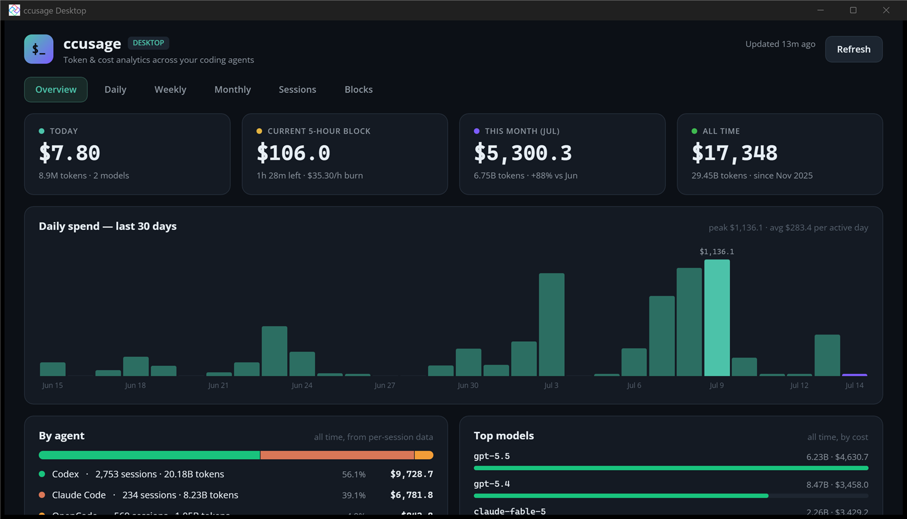

# ccusage Desktop

A polished Windows desktop dashboard for [ccusage](https://github.com/ryoppippi/ccusage) — token & cost analytics across all coding agents (Claude Code, Codex, OpenCode, OpenClaw, Gemini CLI, …). Built with Uno Platform (Skia desktop head, `net10.0-desktop`).



## Features

- **Compact widget (default)** — starts as a small always-glanceable card docked bottom-right above the taskbar: **% used / % left per harness limit** (see below), current 5-hour block (spend, live countdown, burn rate, window progress) + this week (spend, tokens, WoW delta, 7-day mini chart). `Expand` opens the full dashboard (defaults to Weekly); `Mini` collapses back.
- **Limits (% to limit, % until reset)** — per harness, color-coded (teal < 50 % < amber < 80 % < red), with reset times:
  - *Codex*: real percentages parsed from the `rate_limits` snapshots Codex writes into `~/.codex/sessions/**/rollout-*.jsonl` (5-hour + weekly windows as present).
  - *Claude*: **real percentages** — Claude Code hands its official `rate_limits` (5-hour session, weekly all-models, weekly per-model, with reset times) to the statusline hook; `~/.claude/statusline-command.sh` persists that payload to `%LOCALAPPDATA%\ccusage-desktop\claude-rate-limits.json` on every render and the app reads it (ignored when older than 24 h). Fallbacks, in order: the OAuth usage endpoint (when `~/.claude/.credentials.json` holds a valid CLI token), then the vs-personal-max proxy flagged `≈`.
  - *Every other harness ccusage has seen* (OpenCode, OpenClaw, Gemini CLI, …): a weekly vs-personal-max proxy row, computed from `ccusage <agent> daily` aggregated into Monday-anchored weeks. All harnesses always appear.
  - Shown by default in the compact widget and atop the Overview and Weekly tabs; refreshed every 2 minutes.
- **Overview** — KPI cards (today, current 5-hour block with live countdown + burn rate, this month with MoM delta, all-time), 30-day spend chart, all-time per-agent cost split (from per-session data), top models by cost.
- **Daily / Weekly / Monthly** — spend charts + full breakdown tables (input/output/cache tokens, per-day agent chips, model families, cost).
- **Sessions** — top 100 most expensive sessions across all agents.
- **Blocks** — active 5-hour billing block hero (progress, burn rate, projection) + recent completed blocks.

## How it works

The app shells out to the globally-installed `ccusage` CLI (`ccusage <report> --json`) and renders the JSON. Because ccusage scans every agent's transcript logs (minutes on a large history), the app is **cache-first**: the last good JSON per report is persisted to `%LOCALAPPDATA%\ccusage-desktop\cache\` and rendered instantly on launch while a parallel background refresh runs. Auto-refreshes every 15 minutes; block countdowns tick locally every 30 s.

## Requirements

- `ccusage` installed globally (`npm i -g ccusage`) and on PATH. Developed and tested against **ccusage 20.0.14**; the app consumes only its `--json` output (tolerant parsing), so newer versions generally work — if a schema change breaks a report, pin with `npm i -g ccusage@20.0.14`.
- .NET 10 SDK (build) / .NET 10 runtime (run).

> ccusage is a runtime CLI dependency, not vendored source — this repo intentionally has no fork or submodule of [ryoppippi/ccusage](https://github.com/ryoppippi/ccusage).

## Build & run

```powershell
dotnet build CcusageDesktop/CcusageDesktop/CcusageDesktop.csproj -c Debug
CcusageDesktop/CcusageDesktop/bin/Debug/net10.0-desktop/CcusageDesktop.exe
```

Optional args: `--expanded` starts as the full dashboard instead of the compact widget; `--tab <Overview|Daily|Weekly|Monthly|Sessions|Blocks>` opens expanded on a given tab; `--no-refresh` skips the startup background refresh (cache only). Toggle diagnostics land in `%TEMP%\ccusage-desktop.log`.
